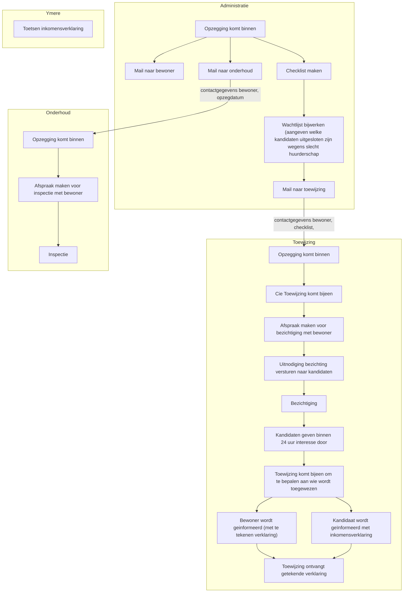

# Jaarplanning

# De vereniging

## Het bestuur

## Bestuursvergaderingen

## ALVs

## Relatie met Ymere

# Organisatie

## De Website

## Kantoor en ICT

## De WAR

## Commissies en Werkgroepen

# Financieën

# Gebouwen

## Onderhoudscyclus

# Bijlagen

## Statuten

## Contract Ymere

## Allonge Ymere

# Voorzitter

## Taken

- Voorbereiden en voorzitten bestuursvergaderingen
- Voorbereiden en voorzitten ALVs
- Contact (onderhouden, eerste aanspreekpersoon) externe partijen
    - Ymere
    - Omgeving (JCK, Academie v Bouwkunst, Knowledge Mile, Bedrijfspanden in DHW (Sterk, Asmara etc.))
    - Gemeente (Gebiedsmakelaar, Stadsdeel (stadsdeelcommissie, dagelijks bestuur))
    - Bewonersorganisaties (Bewonersraad Nieuwmarkt-Groot Waterloo, Wijkcentrum d'Oude Stadt etc.)
- Vrijwilligersbeleid
    - Aantrekken nieuwe bestuursleden en vrijwilligers
    - Beleid vrijwilligersvergoedingen

# Secretaris

## Taken

 - Beheer inkomende post bestuur
    - Kort reageren of doorzetten binnenkomende mail
    - Brieven of vragen aan het gehele bestuur toevoegen aan stukken bestuursvergadering (Ingekomen Post)
    - Legen brievenbus, en zorgen dat post goed terecht komt.
 - Interne communicatie
    - Contact werkgroep Nieuwsbrief
    - Bijhouden website voor bewoners
    - Handboek Bewoners
    - Handboek Bestuurders
- Externe communicatie
    - Bijhouden website voor extern
- Kantoor
    - Aansturen / contact werkgroep ICT
    - Bestellen kantoorartikelen
    - Schoonmaak
    - Inrichting kantoor etc.
- Notulen Bestuursvergaderingen
- Jaarverslag
- Archief
- Statuten en andere belangrijke documenten beheren, kennen (erop toezien dat we ons er aan houden) en eventueel bijwerken
- Registratie KvK bijhouden

# Penningmeester

## Taken

 - Opstellen en presenteren begroting
 - Opstellen (samen met boekhouder) en presenteren jaarrekening
 - In de gaten houden financiele stand van zaken
 - Toezicht op uitgaven / deelbegrotingen werkgroepen
 - Afhandeling betalingen
 - Afhandelen brieven mbt huurachterstanden (?)
 - Op de hoogte houden bestuur van belangrijke financiële ontwikkelingen

 # Verhuur

## Taken Bestuurslid Verhuur

- Mutaties
    - Toewijzingsregels
    - Commissie Toewijzing
    - Afhandelen beëindiging contract
    - Opstellen en archiveren nieuw huurcontract
    - Archieven / bijhouden opslag huurcontracten
- Contact Ymere over huurzaken
    - Opstellen ...verklaring
- Huurvaststelling
    - Jaarlijkse Huurverhoging
    - Huur nieuwe bewoner
- Huurconflicten
    - Zaken huurcommissie
    - Overlast
    - Woonfraude
    - Uitzettingen

## Huren

### Huuradministratie en huurachterstanden

### Huurprijs bepalen

- Afspraak Ymere, huuprijsbeleid in principe hetzelfde als andere Ymere-woningen:
  - Jaarlijkse huurverhoging wordt doorgegeven door Ymere als percentage (krijgen we in maart)
  - Nieuwe woningen starten in principe met maximale huur die (binnen sociale huur) voor de woning gevraagd kan worden. Dit is zo vastgelegd in de Allonge ([artikelnummer]). Uitgangspunten bij het vaststellen van de huur zijn:
    - Alle woningen binnen DHW worden verhuurd als sociale huurwoning. De huurprijs mag dus nooit uitkomen boven:
      - De MRH (maximaal redelijke huur) op basis van de puntenberekening uit het Woning Waardering Stelsel. Het aantal punten stellen wij vast, de bijbehorende maximale huur geeft het ministerie jaarlijks door.
      - De liberalisatiegrens: de maximale huur voor een sociale huurwoning (woningen met hogere huren vallen onder de regels voor geliberaliseerde verhuur). In 2026 was dit € 932,93.
    - Tijdens een overleg van [datum invullen] met Ymere, zijn in aanvulling hierop, nog de volgende versoepelingen gedeeld:
      - Ymere hanteert intern een iets lagere maximale huurprijs voor sociale verhuur dan de door het Ministerie voor Volkshuisvesting vastgestelde liberaliseringsgrens. Wij mogen deze ook aanhouden. In 2026 bedroeg deze interne grens € 910,- euro. In principe stijgt deze grens jaarlijks mee met het percentage van de van Ymere doorgekregen jaarlijkse huurverhoging.
      - In sommige gevallen mogen we bij kandidaten met een (zeer) laag inkomen, de huur naar beneden bijstellen:
        - Het Ministerie voor Volkshuisvesting formuleert zogenaamde [regels voor *passend toewijzen*](https://www.volkshuisvestingnederland.nl/onderwerpen/corporaties-en-regelgeving/daeb/toewijzen-door-woningcorporaties/regels-voor-passend-toewijzen). Deze regels schrijven voor dat duurdere sociale huurwoningen niet kunnen worden toegewezen aan mensen met een laag inkomen.
          - Onder een laag inkomen wordt verstaan (in 2026) een jaarinkomen van onder de €29.400 (€28.775 bij AOW) voor eenpersoonshuishouden of een jaarinkomen van onder de €39.925 (€38.650 bij AOW) voor meerpersoonshuishoudens.
          - Onder een duurdere sociale huurwoning wordt verstaan (in 2026) een woning met een huur van ten minste € 713,02 (tot en met 2 personen) of € 764,14 (vanaf 3 personen).
        - Omdat onze woningen relatief hoge WOZ-waarden hebben, behoren eigenlijk al onze woningen tot deze categorie duurdere sociale huurwoningen wanneer we altijd de maximaal redelijke huur zouden vragen. Dit zou betekenen dat binnen DHW nooit toegewezen kan worden aan mensen met lage inkomens. Zowel DHW als Ymere vinden dat niet wenselijk
        - Om deze reden staat Ymere het ons toe om de huurprijs te verlagen tot de hierboven genoemde grenswaarden voor duurdere sociale huur, wanneer onze kandidaat huurder een inkomen heeft beneden de hierboven genoemde inkomensgrens. Op deze manier kan een DHW toch woningen toewijzen aan huurders met lagere inkomens.

### Servicekosten

### Jaarlijkse huurverhoging

- In de allonge is vastgelegd dat DHW jaarlijks per 1 juli alle huren verhoogt met een door Ymere doorgegeven percentage. Deze huurverhoging moet minimaal 2 maanden van tevoren (dus uiterlijk 30 april) zijn aangekondigd.

#### Nivellering
- In principe is vastgelegd dat we alle huren even sterk laten stijgen tenzij ze daarmee boven de maximale huur uit zouden komen.
- Ymere geeft ons echter de ruimte om de totale huurverhoging volgens een andere verdeling aan onze bewoners door te rekenen. Voorwaarde is uiteraard wel dat de huurverhoging over de totale huursom gelijk blijft. Verder mag de huurverhoging voor geen enkele bewoner uitkomen boven de (dat jaar) wettelijk vastgestelde maximale huurverhoging.
- In 2024 en 2025 is er gebruik gemaakt van deze ruimte om de huren enigszins te nivelleren. Sommige huurders die al lang in het complex wonen betalen een huur die relatief ver onder de door het ministerie vastgestelde maximale huur af zit. Andere huurders betalen een huur van exact de maximaal redelijke huur. Van deze eerste groep steeg de huur in deze jaren sterker dan van de tweede groep.

## Toewijzing

Als een woning vrij komt dan wordt de woning toegewezen door de Commissie Toewijzing van DHW. Afhankelijk van het type woning gelden daarvoor verchillende procedures.

### Gewone zelfstandige woonruimte

Een gewone zelfstandige woning wordt door Toewijzing toegewezen aan ófwel aan de eerste geïnteresseerde op de interne wachtlijst, ófwel via Ymere uit een kwetsbare doelgroep (doorgaans een statushouder). 

### Invalidenwoning

DHW kent drie invalidenwoningen. Ymere (?) zoekt hiervoor geschikte kandidaten.

### 

## Mutaties

1. Opzegging komt binnen:
   1. Bericht naar toewijzing met checklist en wachtlijst en contactgegevens bewoner
   2. Bericht naar onderhoud met contactgegevens bewoner
   3. Standaardmail naar bewoner
2. Inspectie woning door Commissie Onderhoud
   1. Inspectiechecklist (?). Altijd met zijn tweeën?
   2. Onderhoud geeft door aan bewoner wat er door bewoner moet gebeuren
   3. Onderhoud inventariseert evt. klussen die extern worden uitgezet
3. Toewijzing nodigt kandidaten uit voor bezichtiging
4. 

# Bestuurslid Complex

## Taken

- Commissie Onderhoud
    - Klachtenonderhoud
    - Mutaties: inspectie
    - Archivering bouwtekeningen etc.
- Beheer sleutels
- Bijwerken naamplaatjes
- Schoonmaak complex
- Commissie Tuin
- Commissie Citadel
- Contact Ymere mbt Casco-onderhoud

# Bestuurslid Sociaal

## Taken
- Contact WAR (/ lid van WAR?)
- Lustrum
- Welzijn bewoners / contact met bewoners

# Taken bestuur de Halve wereld

Hieronder een overzicht van alle taken van bestuursleden van de halve wereld:

| Vz | Secr | Pm | Verh | Complex | Soc | Taak                                                             |
|----|------|----|------|---------|-----|------------------------------------------------------------------|
| x  | o    |    |      |         |     | Bestuursvergaderingen                                            |
| x  | o    |    |      |         |     | ALV                                                              |
| x  |      |    |      |         |     | Extern contact (Ymere, omgeving, gemeente, bewonersorg.)         |
| x  |      |    |      |         |     | Ceremonieel (toespraken, bedankjes etc.)                         |
| x  |      |    |      |         |     | Vrijwilligersbeleid                                              |
|    | x    |    |      |         |     | Inkomende post bestuur (brieven en e-mail)                       |
|    | x    |    |      |         |     | Interne communicatie (Nieuwsbrief, website etc.)                 |
|    | x    |    |      |         |     | Website                                                          |
|    | x    |    |      |         |     | Handboeken (Bewoners & Bestuurders)                              |
|    | x    |    |      |         |     | Kantoor                                                          |
|    | x    |    |      |         |     | Werkgroep ICT                                                    |
| o  | x    |    |      |         |     | Jaarverslag                                                      |
|    | x    |    |      |         |     | Archief, Reglementen (statuten etc.) & KvK-inschrijving          |
| o  |      | x  |      |         |     | Begroting                                                        |
|    |      | x  |      |         |     | Jaarrekening                                                     |
|    |      | x  |      |         |     | Toezicht op financiën                                            |
|    |      | x  |      |         |     | Betalingen                                                       |
|    |      | x  | o    |         |     | Huurachterstanden                                                |
|    |      |    | x    |         |     | Commissie Toewijzing & Toewijzingsregels                         |
|    |      |    | x    |         |     | Huurcontracten                                                   |
| o  |      |    | x    |         |     | Contact Ymere over huurzaken                                     |
|    |      |    | x    |         |     | Verhuurdersverklaring                                            |
|    |      |    | x    |         |     | Huurbepaling / -verhoging                                        |
| o  |      |    | x    | o       |     | Evt. huurconflicten (huurcommissie, overlast, woonfraude etc.)   |
|    |      |    |      | x       |     | Werkgroep Onderhoud (klachtenonderhoud, mutatieonderhoud)        |
|    |      |    |      | x       |     | Casco-onderhoud / periodiek onderhoud (contact Ymere)            |
|    |      |    |      | x       |     | Inspectie (bij mutaties)                                         |
|    |      |    |      | x       |     | Archivering bouwtekeningen etc.                                  |
|    |      |    |      | x       |     | Beheer sleutels                                                  |
|    |      |    |      | x       |     | Bijwerken naamplaatjes                                           |
|    |      |    |      | x       |     | Schoonmaak en onderhoud algemene ruimten                         |
|    |      |    |      | x       |     | Tuin (Werkgroep Tuin)                                            |
|    |      |    |      | x       |     | Citadel buitenruimte (Werkgroep Citadel)                         |
|    |      |    |      |         | x   | Contact WAR (/ lid van WAR?)                                     |
|    |      |    |      |         | x   | Lustrum                                                          |
|    |      |    |      |         | x   | Welzijn bewoners / contact met bewoners                          |
